  

# AI Mastra Agent Workshop

This workshop demonstrates how to build AI agents that can analyze GitHub pull requests to generate and execute test plans fully autonomously.

  

## Prerequisites and Set-Up Guide

Before the workshop, you need to complete the prerequisites:

- [Prerequisites Guide](PREREQUISITES.MD)

During the workshop itself we will go through the set-up guide together:

- [Set-Up Guide](SETUP.md)

## Workshop Exercises

### Step 1: Create a SCRUM issue

- Create a SCRUM issue on the digital scrum board **OR** use an existing one
  - [https://scrum-board-navy.vercel.app/](https://scrum-board-navy.vercel.app/)
  - Note down the issue number you want to use

### Step 2: Vibe code your new feature and create a pull request

- Open the `demo-webshop` repository in your code editor
- Vibe code a new feature (based on issue in scrumboard - step 1) and create a pull request
  - Make sure to change the base repository for this pull request to your fork
- See the pipeline in action
  - It should post the test plan as comment and after execution of the workflow, it should post the test report as comment

### Step 3: Run Mastra.io Playground and play around with the agents and tools

- Mastra.io Playground
  - Start Mastra.io Playground with `npm run dev`
  - Play around with the testplan agent, supply the pull request URL
  - Play around with the available tools
  - Start the workflow, supply the pull request URL

- Browser Use
  - Inspect the sessions in the Browser Use dashboard
  - [https://cloud.browser-use.com/tasks](https://cloud.browser-use.com/tasks)

## Usefull Resources

If you're interested in learning more about AI agents, you can check out the following resources:

- [Principles of Building AI Agents](https://mastra.ai/book)
- [Building effective agents](https://www.anthropic.com/engineering/building-effective-agents)
- [A practical guide to building agents](https://cdn.openai.com/business-guides-and-resources/a-practical-guide-to-building-agents.pdf)

## Author

**Tim Lolkema**

- LinkedIn: [@timlolkema](https://www.linkedin.com/in/timlolkema/)
- GitHub: [@tlolkema](https://github.com/tlolkema)

## License

Creative Commons Attribution-NonCommercial-ShareAlike 4.0 International License
