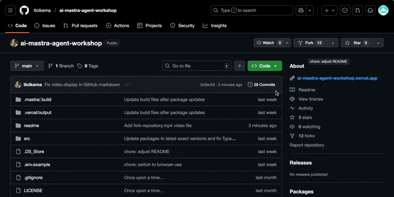
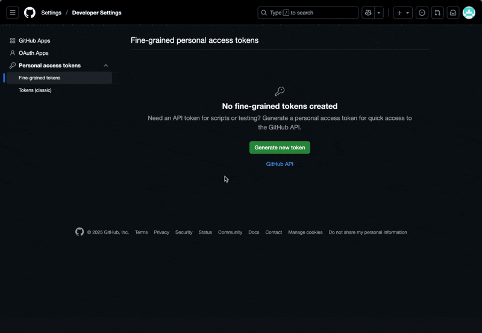
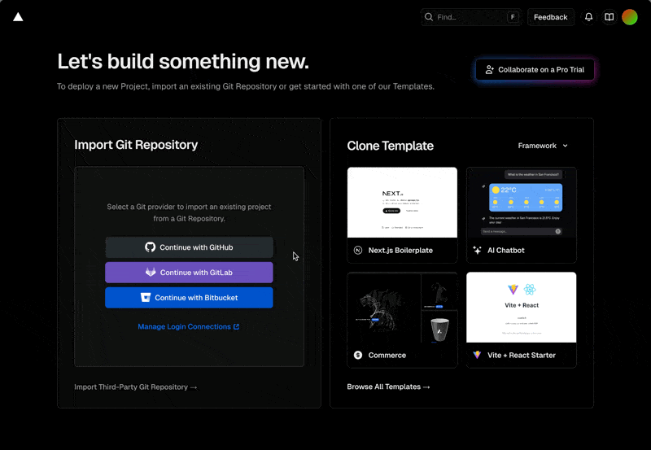
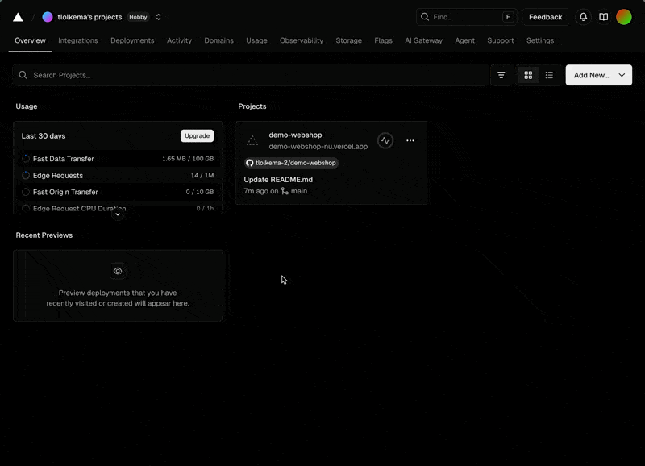
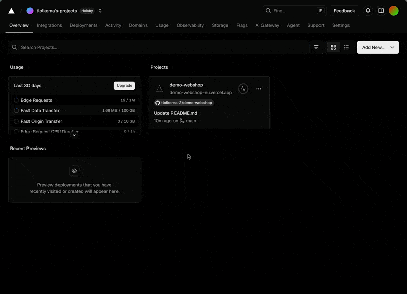

# Set-Up Guide

## Prerequisites

- Basic programming knowledge
- Laptop with installation permissions
- [NodeJS v20 or higher](https://nodejs.org/en/download)
- [GitHub account](https://github.com/)
- [Vercel account](https://vercel.com/)
- [Browser Use account](https://cloud.browser-use.com)

If you haven't completed the prerequisites, see the [Prerequisites Guide](PREREQUISITES.MD) for more information.

## Step 1: Fork/Clone repositories

- Open the following repositories:
  - [https://github.com/tlolkema/demo-webshop](https://github.com/tlolkema/demo-webshop)
  - [https://github.com/tlolkema/ai-mastra-agent-workshop](https://github.com/tlolkema/ai-mastra-agent-workshop)

- Fork the repositories (see video below)
- Untick the "Copy `main` branch only" checkbox
- Do this for both repositories
- Clone the repositories to your local machine



## Step 2: Getting your API keys/tokens

### Create a fine grained GitHub token

Go to:

> https://github.com/settings/personal-access-tokens

Give it access:

- The demo application repository - `demo-webshop`
- Read and write access to <u>issues</u> and <u>pull requests</u>

> This token will be the GITHUB_TOKEN in the .env file



### Create a Browser Use API key

- Create a new Browser Use account [https://cloud.browser-use.com](https://cloud.browser-use.com)
- Go to [https://cloud.browser-use.com/dashboard/api](https://cloud.browser-use.com/dashboard/api)
- Click "Create API Key"
- Give it a name
- Click "Create"

> This API key will be the BROWSER_USE_API_KEY in the .env file

### OpenAI API key

> This key will be supplied to you by the workshop facilitator. This API key will be the OPENAI_API_KEY in the .env file

## Step 3: Add repositories to Vercel

- Login to Vercel

### Demo application repository

- Select the `demo-webshop` repository
  - If you don't see the repository, first link Vercel with GitHub (see video below)
- Click "Deploy"



- Go to [https://vercel.com](https://vercel.com)
- Click on your project `demo-webshop`
- Click "Settings"
- Scroll down to "Vercel Toolbar"
- Disable Vercel Toolbar
- Click "Save"
- Click "Deployment Protection"
- Click "Disable Vercel authentication"



### Mastra repository

- Go to [https://vercel.com](https://vercel.com)
- Click "Add New..."
- Click "Project"
- Select the `ai-mastra-agent-workshop` repository
- Click on **Environment Variables** and add:
  - `OPENAI_API_KEY` = your OpenAI API key
  - `GITHUB_TOKEN` = your GitHub token
  - `BROWSER_USE_API_KEY` = your Browser Use API key
- Click "Deploy"



### Step 4: Adjust the github workflow in the demo application repository

- Open the `demo-webshop` repository in your code editor
- Change the url from the pipeline `.github/workflows/pr-review.yml`
  - Change both occurences of `https://ai-mastra-agent-workshop.vercel.app` to the url of your hosted Mastra instance (see your Vercel project)
- Commit and push the changes to your forked repository

## Step 5: Run Mastra.io Playground

- Make sure you have sorted all the prerequisites
- Install depedencies

```
npm install
```

- Create a `.env` file with the environment variables from Step 2:

```
OPENAI_API_KEY=
GITHUB_TOKEN=
BROWSER_USE_API_KEY=
```

- Run `npm run dev` to start the Mastra.io playground

- You should see something like this:

```
> ai-mastra-agent-workshop@1.0.0 dev
> mastra dev --dir src/mastra

◐ Preparing development environment...
✓ Initial bundle complete
◇ Starting Mastra dev server...

 mastra  0.13.1-alpha.0 ready in 599 ms

│ Playground: http://localhost:4116/
│ API:        http://localhost:4116/api
```

- Go with your browser to the Playground URL e.g. [http://localhost:4116/](http://localhost:4116/)
